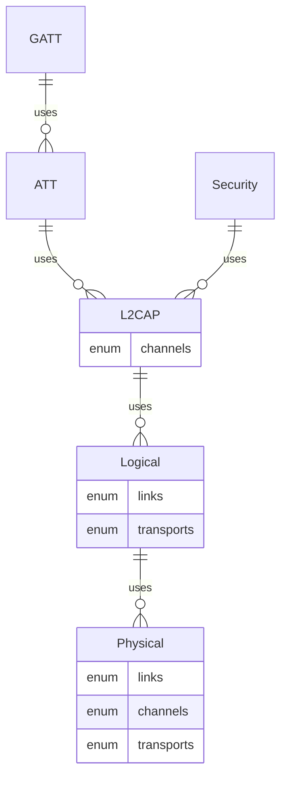

ARCHIVED
================================================================================
I began this project as a way to learn Rust and refactor
[rubble](https://github.com/jonas-schievink/rubble) to provide a fully Rust
Bluetooth stack that could abstract the bluetooth hardware.

What I've found is that the datasheets/user documentation of BlueTooth hardware
does not describe the actual behavior of the hardware - instead manufacturers
provide binary libraries focused on integration with partner operating systems.

Under this paradigm, creating a fully Rust based Bluetooth stack is impractical
as it would require large amounts of effort to reverse engineer the hardware to
determine the proper software implementation.

Using Bluetooth with embedded Rust
--------------------------------------------------------------------------------
One path is to leverage another embedded OS build system to incorporate your
Rust code.

Alternatively, you can integrate their binary library under an RTIC OS by
providing Rust access to the library's functions.

Final words
--------------------------------------------------------------------------------
The tight coupling of hardware and software providers is an unnecessary
constraint on progress. I'll leave the lawyers to determine if these constraints
violate anti-trust provisions.

What should be:
* hardware manufacturers publicly document their hardware
    * rather than only provide documentation to software partners


Bluetooth® Low Energy stack for embedded Rust
================================================================================
Implemented per the [BlueTooth](https://www.bluetooth.com/specifications/specs/)
specifications. The specifications identify both protocol details as well as
test procedures. Leveraging the Rust testing framework, the **test procedures are
implemented at the same time as the implementation** - producing a qualifiable
Bluetooth implementation.

Usage
================================================================================
`Cargo.toml`
```toml
[dependencies]
embedded-ble = { version="0.0.1", features=["nrf52832"] }
```
`feature` chooses the hardware interface:
* Supported
    * nrf51
    * nrf52805
    * nrf52810
    * nrf52811
    * nrf52832
    * nrf52833
    * nrf52840

For usage example see [rtic_demo.rs](ble/examples/rtic_demo.rs).

Demo
================================================================================
**The demo(s) are setup for nrf52832.**  
(if you wish to run on other targets, see [configuring demo](#demo_config))

```sh
cargo embed --example rtic_demo --features nrf52832 --target thumbv7em-none-eabihf
```

<a id="demo_config">Configuring Demos For Other Hardware</a>
--------------------------------------------------------------------------------
TODO

Unit Testing
================================================================================
```sh
cargo test --lib --features nrf52832
```

Architecture
================================================================================



