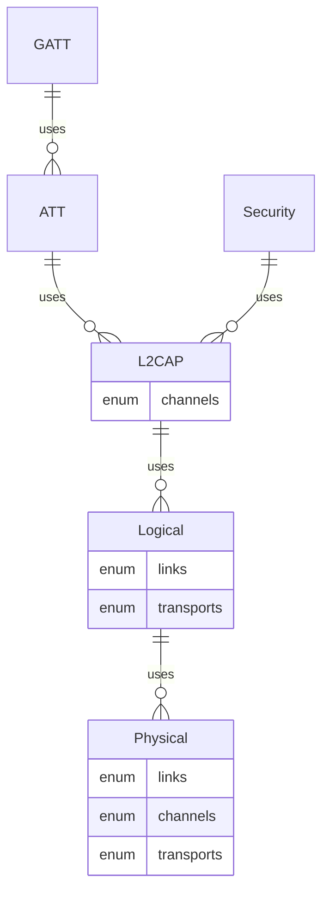

Bluetooth® Low Energy stack for embedded Rust
================================================================================
Implemented per the [BlueTooth](https://www.bluetooth.com/specifications/specs/)
specifications. The specifications identify both protocol details as well as
test procedures. Leveraging the Rust testing framework, the **test procedures are
implemented at the same time as the implementation** - producing a qualifiable
Bluetooth implementation.



<!-- `Host` is implemented in [`ble`](ble/). This implementation is hardware agnostic.

`Controller/HCI` is implemented in `*-hci`
* [nrf52x-hci](nrf5x-hci/) supports [nrf52 family](https://github.com/nrf-rs/nrf-hal) -->


Demo
================================================================================
The repos's [Embed.toml](Embed.toml) is setup for `chip = "nRF52832_xxAA"` - if
you wish to run on other targets, you'll need to modify accordingly.

```sh
cargo embed --example rtic_demo --features nrf52832 --target thumbv7em-none-eabihf
```


