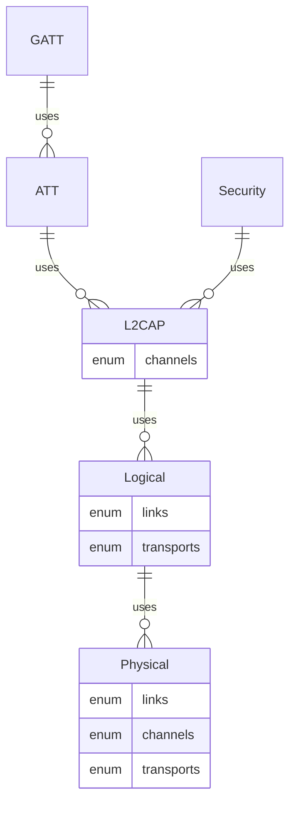

Bluetooth® Low Energy stack for embedded Rust
================================================================================
Implemented per the [BlueTooth](https://www.bluetooth.com/specifications/specs/)
specifications. The specifications identify both protocol details as well as
test procedures. Leveraging the Rust testing framework, the **test procedures are
implemented at the same time as the implementation** - producing a qualifiable
Bluetooth implementation.

Usage
================================================================================
`Cargo.toml`
```toml
[dependencies]
embedded-ble = { version="0.0.1", features=["nrf52832"] }
```
`feature` chooses the hardware interface:
* Supported
    * nrf51
    * nrf52805
    * nrf52810
    * nrf52811
    * nrf52832
    * nrf52833
    * nrf52840

For usage example see [rtic_demo.rs](ble/examples/rtic_demo.rs).

Demo
================================================================================
**The demo(s) are setup for nrf52832.**  
(if you wish to run on other targets, see [configuring demo](#demo_config))

```sh
cargo embed --example rtic_demo --features nrf52832 --target thumbv7em-none-eabihf
```

<a id="demo_config">Configuring Demos For Other Hardware</a>
--------------------------------------------------------------------------------
TODO

Unit Testing
================================================================================
```sh
cargo test --lib --features nrf52832
```

Architecture
================================================================================



